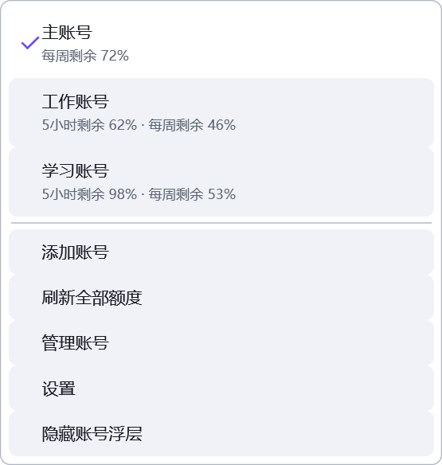
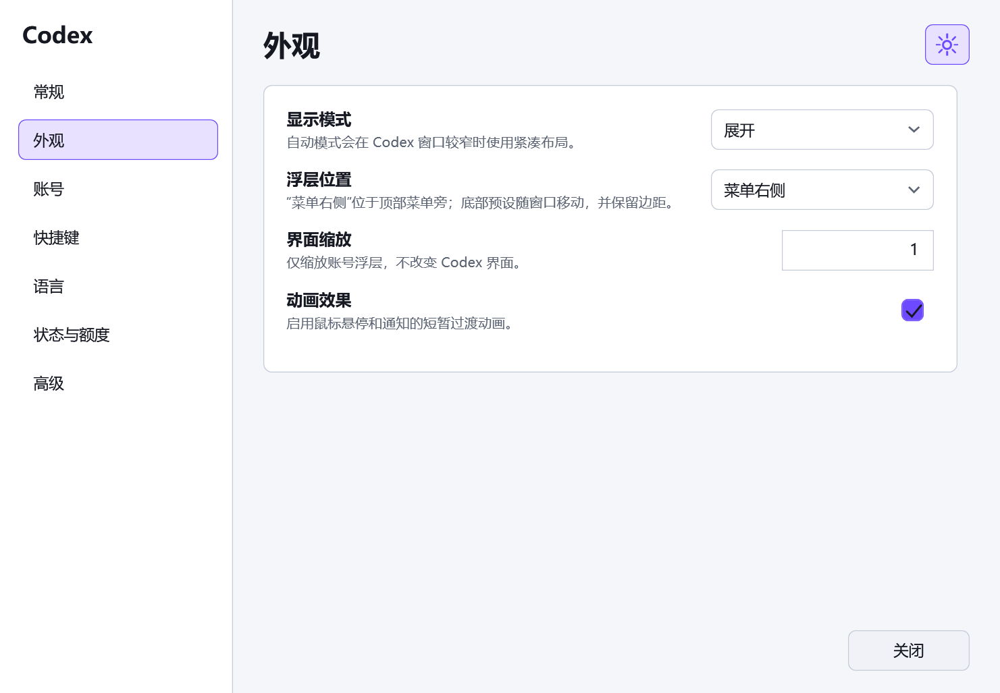
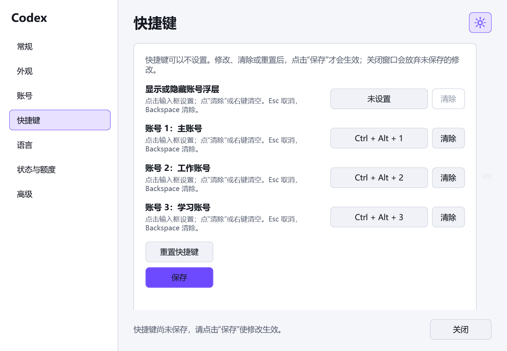
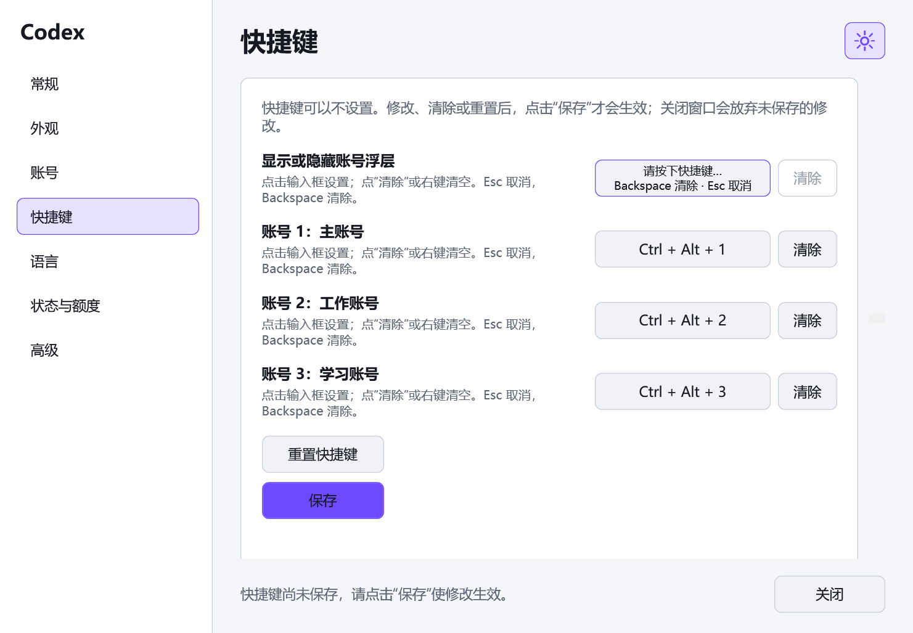
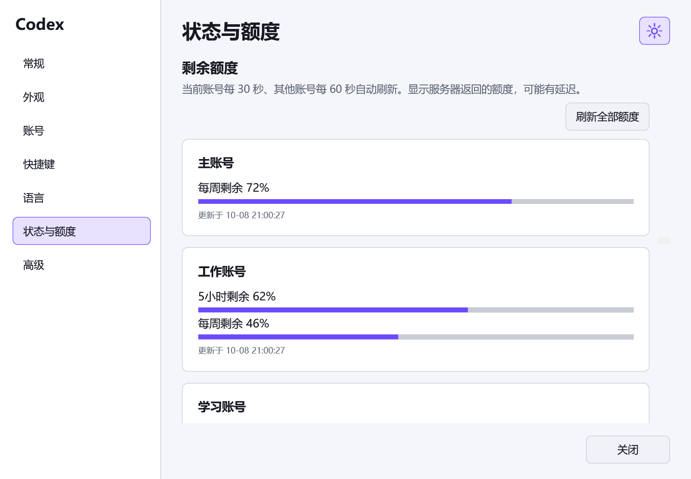

<div align="center">

# Codex Swap Account

**Windows 上的 Codex 多账号切换与额度面板。**

在 Codex 窗口旁查看多个账号的剩余额度，选择账号完成切换，并继续使用本机的聊天记录与工作区。

**简体中文** · [English](README_EN.md)

[下载程序 EXE](https://github.com/babatuosi936/codex-swap-account-zh-cn/releases/latest/download/CodexProfileOverlay.exe) · [版本发布页](https://github.com/babatuosi936/codex-swap-account-zh-cn/releases/tag/v1.1.0-zh.1) · [使用说明](#快速开始)

日常使用下载 EXE 即可，直接运行，无需解压或额外安装 .NET。

</div>


## 它能做什么

如果你使用多个 Codex 账号，希望在切换前看清哪个账号还有额度，这个工具可以把账号与额度集中放在 Codex 窗口旁。账号完成登录并保存后，日常通过浮层或托盘选择账号即可发起切换。

| 功能 | 使用体验 |
| --- | --- |
| 多账号管理与切换 | 添加、命名和管理账号，从浮层、托盘或自定义快捷键发起切换；当前账号高亮显示。 |
| 多账号额度面板 | 同时查看可查询到的 5 小时、每周剩余百分比，支持自动更新与“刷新全部额度”。 |
| 继续使用已有工作内容 | 切换针对账号授权，本机的 Codex 聊天记录、会话与工作区保持共享。 |
| 两种浮层布局 | 展开模式直接显示多个账号；紧凑模式用一个账号按钮与菜单节省空间，也可随窗口宽度自动选择。 |
| 自定义位置与外观 | 支持拖动、位置记忆、菜单右侧和底部三种预设位置，以及缩放、明暗主题与 Windows DPI 适配。 |
| 鼠标或快捷键操作 | 全部日常操作可以通过鼠标完成；快捷键可自定义或不设置，修改后点击“保存”才生效。 |
| 中文界面与托盘入口 | 设置、账号、额度和提示支持简体中文；也提供英文、俄文及系统语言选择。托盘可管理账号、设置与浮层显示。 |
| 授权备份与恢复 | 切换前备份授权；切换失败时尝试恢复此前授权，并显示结果提示。 |

切换账号会关闭并重新启动 Codex，因此请在当前工作结束后再切换。额度来自服务端查询，可能有更新延迟。

## 快速开始

运行环境：**Windows 10/11 x64 + Codex 桌面版**。添加账号和自动额度查询还需要可用的 Codex CLI。

1. 点击 [下载程序 EXE](https://github.com/babatuosi936/codex-swap-account-zh-cn/releases/latest/download/CodexProfileOverlay.exe)，保存 `CodexProfileOverlay.exe`。
2. 把 EXE 放在固定文件夹，双击运行。它已包含运行时，无需额外安装 .NET。
3. 打开 Codex，工具识别到窗口后会显示账号浮层；也可从系统托盘显示或隐藏。
4. 在“设置 → 语言”选择简体中文。中文系统默认语言也可自动使用中文。
5. 点击“添加账号”完成账号登录。添加好多个账号后，浮层会显示账号名称和可查询到的剩余额度。
6. 选择目标账号，确认后等待 Codex 重新打开，即可继续使用。

不需要快捷键时，进入“设置 → 快捷键”，逐项点击“清除”，然后点击“保存”。想换位置，直接拖动浮层，或在“设置 → 外观”选择位置预设。

**ZIP 是可选的。** 如果还想保留中英文图文说明，可下载 [程序与说明文档 ZIP](https://github.com/babatuosi936/codex-swap-account-zh-cn/releases/latest/download/CodexProfileOverlay-win-x64-portable.zip)，解压后运行其中的 EXE。它与单独下载的 EXE 是同一个程序，功能相同，选一种下载即可。

[版本发布页](https://github.com/babatuosi936/codex-swap-account-zh-cn/releases/latest)提供升级说明及 `SHA256SUMS.txt` 校验文件。校验文件用于核对下载是否完整，不是运行程序必需的文件。Windows 可能对未签名程序显示 SmartScreen 提示，可根据来源与发布页校验值自行判断是否运行。

当前仓库为私有仓库，访问代码、配图和下载附件需要相应的 GitHub 权限。

## 界面预览

以下图片由程序的真实 WPF 控件渲染。**账号名称和额度均为演示数据**，没有使用真实邮箱、账号凭据或聊天内容。

### 展开与紧凑模式

展开模式直接展示多个账号与额度；紧凑模式适合较窄的窗口。


紧凑菜单中的“刷新全部额度”会保留菜单，刷新结果更新后可以继续查看账号。



### 圆角操作菜单

添加账号、刷新额度、账号管理、设置及隐藏浮层集中在这里。


### 位置、显示模式与缩放

拖动可以调整浮层位置，也可以在设置中选择位置预设。界面缩放只影响账号浮层。



### 快捷键可以不设置

点“清除”或右键清空后会显示“未设置”。录入时，框内直接提示 **Backspace 清除 · Esc 取消**。修改、清除、重置都先暂存，点击“保存”才会应用；没有保存就关闭窗口，会保留原来的快捷键。





### 额度与自动刷新

显示可查询到的剩余比例。未知或暂不可查询的额度显示为不可用，不能当作 0%。



额度通过定时查询更新，可能有延迟；它不是服务器主动推送的实时读数，也不代表还能发送多少条固定长度的消息。

## 常见问题

**它是安装在 Codex 里的插件吗？**

它是独立运行的 Windows 桌面工具，通过浮层和系统托盘配合 Codex 桌面版使用。解压运行即可，不需要安装到 VS Code 的扩展目录。

**额度多久更新一次？**

启用自动查询后，默认当前账号每 30 秒、其他账号每 60 秒刷新，可在设置中调整，也可手动刷新全部账号。服务端尚未返回新数据时，显示值可能有延迟；未能查询到的额度不会当成 0%。

**快捷键必须设置吗？**

不必须。每项都可以清除为“未设置”，仅使用鼠标操作。快捷键修改、清除和重置都需要点击“保存”才会应用，未保存就关闭窗口会保留原值。

**切换后原来的聊天记录还在吗？**

本机 Codex 会话、聊天记录与工作区保持共享，工具切换的是账号授权。这里指本机保存的数据，不是不同 ChatGPT 账号之间的云端聊天合并。

## 相对原项目的升级

上面介绍的是这个版本的完整使用能力。以下单独说明本次二次开发增加或改进的部分；多账号切换、共享本地会话、授权备份与回滚、托盘等基础能力来自原项目。

| 方向 | 本次改进 |
| --- | --- |
| 简体中文 | 在英文、俄文基础上增加中文设置、菜单、账号、额度与提示。 |
| 额度展示与刷新 | 从状态指示扩展为浮层中的剩余百分比；默认自动查询由当前账号 15 分钟、其他账号 60 分钟调整为 30 秒、60 秒，并允许调整。 |
| 浮层与位置 | 增加拖动及位置记忆，默认高度调整为 44 个逻辑像素；三个顶部预设改为底部左侧、居中、右侧，保留边距。 |
| 快捷键保存 | 将录入后立即应用改为先暂存、点击“保存”后应用；增加单项清除、右键清空、录入框内的 Backspace 提示，移除“全部清除”按钮。 |
| Windows 切换兼容 | 调整本地验证过的 Codex 进程识别与启动逻辑，缩小关闭范围，让助手独立于 Codex 的重启运行。 |
| 刷新与拖动交互 | 修复紧凑菜单刷新后的错位和收起，以及按住第三个账号拖动时主账号被滚走的问题。 |
| 弹窗与外观 | 确认框限制在可见区域，辅助窗口最小化后隐藏并可复用，操作菜单与高亮项增加圆角，颜色与手动状态设置常驻显示。 |
| 文档与下载 | 增加中文图文使用说明、演示配图与升级记录；便携包包含说明和原项目许可证。 |

完整改动见 [升级记录](CHANGELOG_ZH.md)。

## 数据与配置

- 账号授权与切换备份保存在本机，不应提交或上传 `auth.json`、账号目录、日志或备份。
- 常规设置目录为 `%LOCALAPPDATA%\CodexProfileOverlay`；检测到已有 Codex 打包环境的数据目录时，会继续复用它。
- 切换流程针对授权数据，不复制整个用户目录或工作区；共享会话等行为沿用上游设计。
- 额度查询会与服务端通信。网络、登录状态、服务端响应以及 Codex CLI 兼容性会影响可用性。
- 本仓库仅包含源码、说明和演示配图，运行时生成的数据与凭据被排除。

## 构建与验证

开发环境需要 .NET 8 SDK。交互界面检查需要 Windows 桌面环境。

```powershell
dotnet build CodexProfileOverlay.sln -c Release -p:Platform=x64
dotnet test CodexProfileOverlay.sln -c Release -p:Platform=x64
.\publish.ps1 -Configuration Release
```

便携包输出到 `artifacts/`。Windows CI 会构建、运行核心测试、检查仓库文件，并生成下载附件。

快捷键保存及窗口布局检查可以单独运行：

```powershell
dotnet run --project tests/OverlayUiRegression/OverlayUiRegression.csproj -c Release -p:Platform=x64 -- --hotkeys-only
dotnet run --project tests/OverlayUiRegression/OverlayUiRegression.csproj -c Release -p:Platform=x64 -- --header-only
```

演示图可重复生成，过程使用模拟账号与额度，不读取真实授权：

```powershell
dotnet run --project tests/OverlayUiRegression/OverlayUiRegression.csproj -c Release -p:Platform=x64 -- --docs docs/images/zh-CN
```

更详细的内部说明见 [架构文档](docs/ARCHITECTURE.md) 和 [界面检查说明](tests/OverlayUiRegression/README.md)。

## 当前验证范围

本次增强版在本地 Windows 与 .NET 8 环境完成构建、核心测试及针对性 WPF 交互检查。账号切换、额度查询依赖本机 Codex 和实际登录状态，隔离界面检查不等同于真实账号切换的端到端验证。尚未声称覆盖所有 Codex 版本或显示器组合。

问题反馈请说明 Codex 版本、显示缩放、浮层模式和复现步骤；截图前请遮挡真实邮箱和账号信息。

## 项目来源、致谢与许可证

**本项目基于 [ZOONGG/codex-swap-account](https://github.com/ZOONGG/codex-swap-account) 二次开发。** 账号管理、切换事务、授权回滚、共享本地会话、托盘与浮层等基础实现来自 ZOONGG 与上游贡献者；本仓库在此基础上维护中文适配、Windows 兼容修复和交互优化。感谢原作者及所有贡献者。

沿用原项目 [MIT 许可证及版权声明](LICENSE)。引入时的英文说明保存在 [README_UPSTREAM.md](README_UPSTREAM.md)，俄文说明保存在 [README_RU.md](README_RU.md)。上游可参考 [v1.0.0](https://github.com/ZOONGG/codex-swap-account/tree/v1.0.0)；本仓库首个提交保存引入时的源码快照，后续提交记录本次升级过程。

这是独立维护的社区版本，与 OpenAI 没有隶属或官方合作关系。
